# 📋 العرض التقني — نظام إدارة الصلاحيات (AdminModule)

## Présentation Technique — Système de Gestion des Permissions

---

## 📑 فهرس المحتويات

1. [نظرة عامة على التطبيق](#1--نظرة-عامة-على-التطبيق)
2. [البنية المعمارية (Architecture)](#2--البنية-المعمارية-architecture)
3. [المكدس التقني (Tech Stack) — مع تبرير الإختيارات](#3--المكدس-التقني-tech-stack)
4. [محرك الصلاحيات (Permission Engine) — تفصيل كامل](#4--محرك-الصلاحيات-permission-engine)
5. [المتغيرات الديناميكية و Context Variables](#5--المتغيرات-الديناميكية-و-context-variables)
6. [الحلول المقترحة — الإيجابيات و السلبيات](#6--الحلول-المقترحة--الإيجابيات-و-السلبيات)
7. [إدماج Permission Engine في المحاور الجديدة](#7--إدماج-permission-engine-في-المحاور-الجديدة)
8. [الأمان (Security Architecture)](#8--الأمان-security-architecture)
9. [بنية الواجهة الأمامية (Frontend Architecture)](#9--بنية-الواجهة-الأمامية-frontend-architecture)
10. [الأداء والتخزين المؤقت (Performance & Caching)](#10--الأداء-والتخزين-المؤقت-performance--caching)
11. [خريطة الطريق (Roadmap)](#11--خريطة-الطريق-roadmap)

---

## 1. 🔍 نظرة عامة على التطبيق

**AdminModule** هو نظام إدارة مركزي يوفر:

- **إدارة المستخدمين و الأدوار** — CRUD كامل مع تعيين أدوار متعددة
- **نظام صلاحيات مرن ثلاثي المستويات** — أقوى جزء في التطبيق
- **لوحة تحكم (Dashboard)** — إحصائيات حية مع رسوم بيانية
- **سجل المراجعة (Audit Trail)** — تتبع كل عملية في النظام
- **إعدادات النظام (System Config)** — تكوين ديناميكي
- **وحدة التجنيد (Recruitment)** — كأول تطبيق عملي للصلاحيات

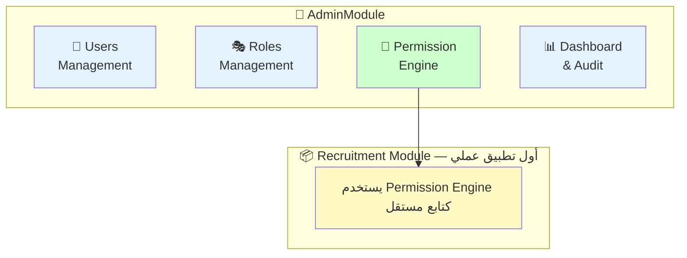

---

## 2. 🏗️ البنية المعمارية (Architecture)

### Clean Architecture — أربع طبقات

اخترنا **Clean Architecture** كنمط معماري رئيسي:

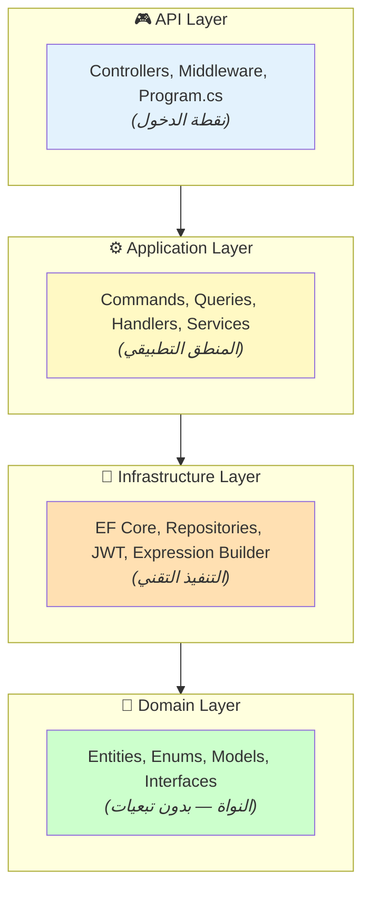

**لماذا Clean Architecture؟**

| السبب | التفسير |
|-------|---------|
| **فصل المسؤوليات** | كل طبقة مسؤولة عن شيء واحد فقط |
| **قابلية الاختبار** | Domain و Application لا تعتمدان على Infrastructure |
| **قابلية التوسع** | إضافة محور جديد لا تتطلب تعديل الطبقات الموجودة |
| **استبدال التقنية** | تغيير قاعدة البيانات لا يؤثر على المنطق التطبيقي |

### نمط CQRS (Command Query Responsibility Segregation)

فصلنا عمليات **القراءة (Queries)** عن **الكتابة (Commands)**:

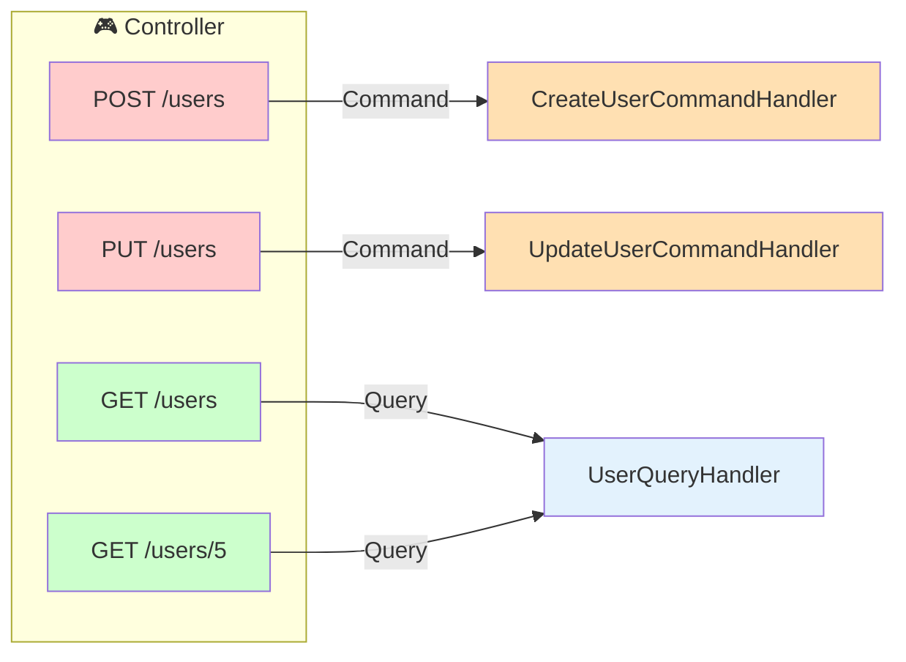

**الفائدة:** كل Handler يتعامل مع عملية واحدة فقط → كود أنظف، أسهل في الصيانة.

**عدد الـ Handlers المسجلة:**

| الفئة | Handlers |
|-------|----------|
| Auth | `LoginCommandHandler`, `RefreshTokenCommandHandler`, `LogoutCommandHandler`, `CreateUserCommandHandler`, `ResetPasswordCommandHandler` |
| Users | `UserQueryHandler`, `UpdateUserCommandHandler`, `DeleteUserCommandHandler`, `ToggleUserStatusCommandHandler`, `AssignRolesCommandHandler`, `RevokeUserSessionsCommandHandler` |
| Roles | `RoleQueryHandler`, `CreateRoleCommandHandler`, `UpdateRoleCommandHandler`, `DeleteRoleCommandHandler`, `ToggleRoleStatusCommandHandler` |
| Permissions | `PermissionQueryHandler`, `UpdateModulesPermissionHandler`, `UpdateSchemaPermissionHandler`, `UpdateDataRowPermissionHandler`, `ClonePermissionHandler` |
| Recruitment | `CreatePersonnelCommandHandler`, `UpdatePersonnelCommandHandler`, `AssignToCorgeCommandHandler`, `RecruitmentQueryHandler` |
| Admin | `AuditQueryHandler`, `DashboardQueryHandler`, `ConfigQueryHandler`, `UpdateConfigHandler` |

**المجموع: 28 Handler** — كل واحد مسؤول عن عملية واحدة.

---

## 3. 🛠️ المكدس التقني (Tech Stack)

### 3.1 الواجهة الخلفية (Backend)

| التقنية | الإصدار | سبب الاختيار |
|---------|---------|-------------|
| **.NET 8** | 8.0 | أحدث LTS، أداء عالي، دعم `IMemoryCache` مدمج، Native AOT |
| **ASP.NET Core** | 8.0 | Middleware pipeline قوي، يسمح بإدراج `PermissionContextMiddleware` بسهولة |
| **Entity Framework Core** | 8.0 | ORM ناضج، يدعم `Expression<Func<T,bool>>` مباشرة — ضروري لـ DataRow filtering |
| **SQL Server** | — | Windows Auth للبيئة المحلية، موثوق في بيئات المؤسسات |
| **JWT (JSON Web Tokens)** | — | Stateless auth، يحمل Claims في الـ Token نفسه |

**لماذا .NET 8 وليس بديل آخر؟**

- **EF Core Expression Trees**: محرك الصلاحيات يحتاج بناء `Expression<Func<T, bool>>` ديناميكياً → EF Core يحولها مباشرة إلى SQL `WHERE` — لو استخدمنا Python/Django أو Node.js لم نجد ما يعادل هذا بنفس السلاسة
- **Strongly Typed**: التعامل مع Enums مثل `ComparisonOperator` و `PermissionEffect` يكون أكثر أماناً
- **Performance**: Kestrel من أسرع الـ HTTP servers في الـ benchmarks

### 3.2 الواجهة الأمامية (Frontend)

| التقنية | الإصدار | سبب الاختيار |
|---------|---------|-------------|
| **Next.js** | 15.5.12 | API Routes كـ Proxy آمن، SSR/SSG مدمج، App Router |
| **React** | 19.2.3 | أحدث إصدار مستقر، Suspense و Server Components |
| **TypeScript** | — | Type Safety ضروري لمشروع بهذا الحجم |
| **Tailwind CSS** | v4 | Utility-first، بناء UI سريع، RTL support قوي |
| **shadcn/ui + Radix** | — | 57+ مكوّن جاهز، قابل للتخصيص، Accessible (a11y) |
| **TanStack Query** | v5 | إدارة الـ Server State، تخزين مؤقت تلقائي، invalidation ذكي |
| **TanStack Table** | v8 | جداول بيانات متقدمة (فرز، بحث، pagination، تحديد) |
| **Zustand** | v5 | إدارة Client State خفيفة (< 1KB)، أبسط من Redux |
| **React Hook Form + Zod** | v7 + v4 | تحقق من المدخلات في الـ Frontend مع schemas قابلة لإعادة الاستخدام |
| **Framer Motion** | v12 | رسوم متحركة سلسة (page transitions, hover effects) |
| **Recharts** | v2 | رسوم بيانية في لوحة التحكم (Bar, Pie, Line charts) |
| **Lucide React** | — | مكتبة أيقونات حديثة، خفيفة، متناسقة |

**لماذا Next.js 15 وليس Vite + React؟**

| الميزة | Next.js 15 | Vite + React |
|--------|-----------|-------------|
| API Proxy آمن | ✅ مدمج → HTTP-only cookies | ❌ يحتاج إعداد منفصل |
| SSR / SEO | ✅ مدمج | ❌ CSR فقط |
| Middleware | ✅ مدمج → auth check | ❌ غير متاح |
| File-based routing | ✅ تلقائي | ❌ يدوي |

**الـ API Proxy** كان حلاً محورياً: الـ Frontend يتواصل مع `/api/proxy/...` (Next.js) → Next.js يحوّل الطلب إلى Backend مع الـ cookies → الـ Access Token لا يظهر أبداً في الـ Browser.

### 3.3 هيكل المشروع

```
AdminModule/                          # Backend Solution
├── AdminModule.API/                  # طبقة الـ API
│   ├── Controllers/
│   │   ├── AuthController.cs         # تسجيل دخول/خروج
│   │   ├── RecruitmentController.cs  # وحدة التجنيد
│   │   └── Admin/                    # 7+ controllers إدارية
│   ├── Middleware/
│   │   └── PermissionContextMiddleware.cs  # 270 سطر
│   └── Program.cs                    # تكوين الخدمات
│
├── AdminModule.Application/          # طبقة التطبيق
│   ├── Admin/                        # 28 Handler
│   │   ├── Users/Commands/Queries/
│   │   ├── Roles/Commands/Queries/
│   │   ├── Permissions/Commands/Queries/Services/
│   │   ├── Audit/Queries/
│   │   ├── Dashboard/Queries/
│   │   └── Config/Commands/Queries/
│   ├── Auth/Commands/
│   ├── Recruitment/Commands/Queries/
│   └── Permissions/
│       └── PermissionService.cs      # 420 سطر — الخدمة الرئيسية
│
├── AdminModule.Domain/               # طبقة النواة
│   ├── Permessions/
│   │   ├── Enum/                     # 3 تعدادات
│   │   ├── Models/                   # 10 نماذج
│   │   └── Interfaces/              # 3 واجهات
│   ├── Admin/
│   │   ├── DTOs/                    # 37 DTO
│   │   └── Interfaces/             # 7 واجهات
│   ├── Entities/                    # كيانات قاعدة البيانات
│   └── Auth/
│
├── AdminModule.Infrastructure/       # طبقة البنية التحتية
│   ├── Permissions/
│   │   ├── EfExpressionBuilder.cs        # تحويل JSON → LINQ Expression
│   │   ├── PermissionPolicyProvider.cs   # تحميل ودمج الصلاحيات
│   │   ├── CachedPermissionPolicyProvider.cs  # Decorator Cache
│   │   └── PermissionCacheInvalidator.cs # إبطال الذاكرة المؤقتة
│   ├── Persistence/AppDbContext.cs
│   ├── Migrations/
│   └── Auth/, Admin/, Recruitment/
│
FrontendAdmin/admin-frontend/         # Frontend (Next.js 15)
├── src/
│   ├── app/                          # App Router pages
│   ├── components/                   # UI Components
│   ├── lib/                          # Services, hooks, stores
│   └── styles/                       # Tailwind + custom CSS
```

---

## 4. 🔐 محرك الصلاحيات (Permission Engine) — القلب النابض

### 4.1 فلسفة التصميم

صمّمنا محرك الصلاحيات ليكون:

1. **JSON-Driven** — الصلاحيات مخزّنة كنصوص JSON في قاعدة البيانات → تعديل بدون Migration
2. **ثلاثي المستويات** — كل مستوى يعمل في طبقة مختلفة من Clean Architecture
3. **قابل للتوسع** — إضافة جداول أو حقول جديدة لا تتطلب تغيير كود المحرك
4. **ديناميكي** — يدعم متغيرات `$user.X` و `$context.Y` تُستبدل وقت التشغيل

### 4.2 المستويات الثلاثة

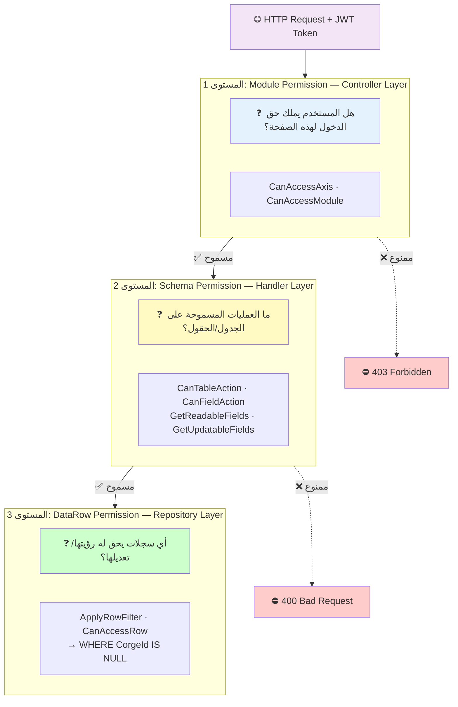

### 4.3 هيكل البيانات في قاعدة البيانات

جدول واحد `Permissions` يربط بجدول `Roles`:

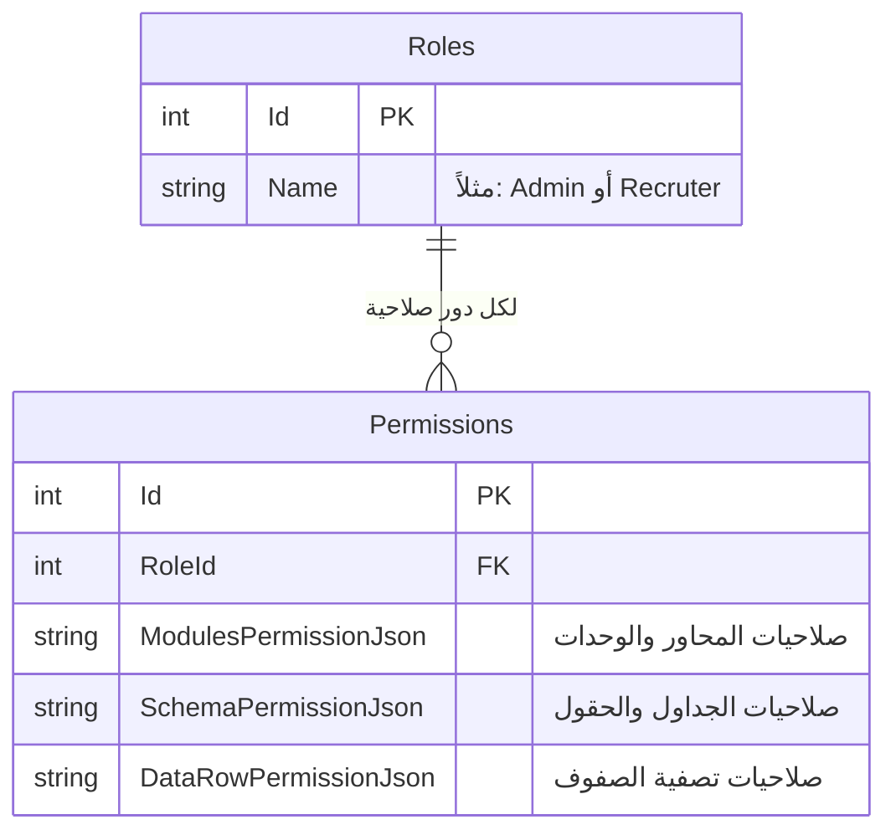

### 4.4 هياكل JSON الثلاثة

#### المستوى 1 — ModulesPermissionJson

<details>
<summary>📄 مثال كامل — ModulesPermissionJson</summary>

```json
{
  "axes": {
    "AX_ADMIN": {
      "enabled": true,
      "modules": {
        "USERS_LIST": { "enabled": true },
        "USERS_ADD": { "enabled": true },
        "ROLES_LIST": { "enabled": true },
        "PERMISSIONS": { "enabled": true },
        "AUDIT_LOG": { "enabled": true },
        "SYSTEM_CONFIG": { "enabled": true },
        "DASHBOARD": { "enabled": true }
      }
    },
    "AX_RECRUTEMENT": {
      "enabled": true,
      "modules": {
        "RECRUTEMENT_LIST": { "enabled": true },
        "RECRUTEMENT_ADD": { "enabled": true },
        "RECRUTEMENT_EDIT": { "enabled": true }
      }
    },
    "AX_PERSONNEL": {
      "enabled": false,
      "modules": { }
    }
  }
}
```

</details>

**الفكرة:** هيكل شجري بسيط `Axes → Modules` مع `enabled: true/false`.

#### المستوى 2 — SchemaPermissionJson

<details>
<summary>📄 مثال كامل — SchemaPermissionJson</summary>

```json
{
  "tables": {
    "Personnel": {
      "actions": ["read", "create", "update"],
      "fields": {
        "Nom":           { "actions": ["read", "update"] },
        "Prenom":        { "actions": ["read", "update"] },
        "GradeId":       { "actions": ["read", "update"] },
        "DepartementId": { "actions": ["read"] }
      }
    },
    "Grade": {
      "actions": ["read"],
      "fields": {
        "*": { "actions": ["read"] }
      }
    }
  }
}
```

</details>

**الفكرة:**
- كل جدول يحدد العمليات المسموحة عليه (`actions`)
- كل حقل يحدد عملياته المسموحة أيضاً
- `"*"` = Wildcard → كل الحقول (مفيد للـ Admin أو الجداول المرجعية)

#### المستوى 3 — DataRowPermissionJson

<details>
<summary>📄 مثال كامل — DataRowPermissionJson</summary>

```json
{
  "rules": [
    {
      "table": "Personnel",
      "effect": "allow",
      "priority": 100,
      "description": "يرى فقط المجندين بدون فيلق أو موظفي قسمه",
      "conditions": {
        "logic": "OR",
        "rules": [
          { "left": "CorgeId", "operator": "IS_NULL", "right": null },
          { "left": "DepartementId", "operator": "=", "right": "$user.DepartementId" }
        ]
      }
    },
    {
      "table": "Personnel",
      "effect": "deny",
      "priority": 200,
      "description": "يستثني المنتدبين",
      "conditions": {
        "logic": "AND",
        "rules": [
          { "left": "Dtdetachement", "operator": "IS_NOT_NULL", "right": null }
        ]
      }
    }
  ]
}
```

</details>

**الفكرة:**
- **Allow/Deny** مع نظام أولوية (Priority)
- **Deny يفوز دائماً** على Allow
- شروط مركّبة (AND/OR) مع دعم التداخل (nested conditions)
- متغيرات ديناميكية `$user.X`, `$context.Y`

### 4.5 نماذج الـ Domain (Domain Models)

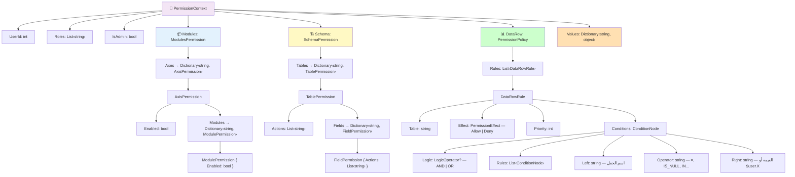

### 4.6 عوامل المقارنة المدعومة (13 نوع)

```csharp
public enum ComparisonOperator
{
    Equal,              // =, ==, Equal
    NotEqual,           // !=, <>, NOT_EQUAL
    GreaterThan,        // >, GREATER_THAN
    GreaterThanOrEqual, // >=
    LessThan,           // <, LESS_THAN
    LessThanOrEqual,    // <=
    In,                 // IN → WHERE x IN (1,2,3)
    NotIn,              // NOT_IN → WHERE x NOT IN (...)
    Contains,           // CONTAINS, LIKE → WHERE x LIKE '%val%'
    StartsWith,         // STARTS_WITH → WHERE x LIKE 'val%'
    EndsWith,           // ENDS_WITH → WHERE x LIKE '%val'
    IsNull,             // IS_NULL → WHERE x IS NULL
    IsNotNull           // IS_NOT_NULL → WHERE x IS NOT NULL
}
```

كل عامل يقبل **عدة صيغ كتابة** غير حساسة لحالة الأحرف (مثلاً `"="`, `"Equal"`, `"equal"` كلها تعمل).

### 4.7 مسار تنفيذ الطلب (Request Pipeline)

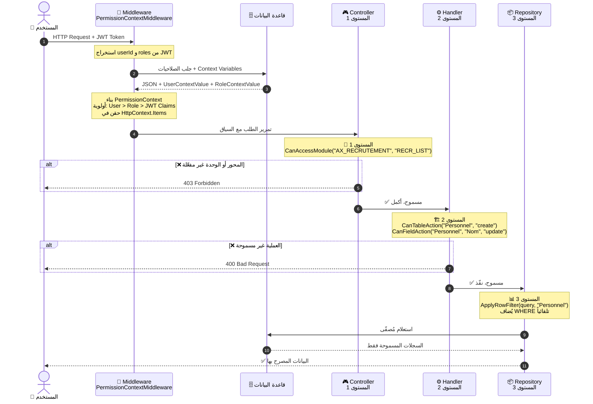

### 4.8 آلية بناء التعابير (Expression Builder)

**EfExpressionBuilder** هو القلب التقني لمحرك الصلاحيات — يحوّل هيكل JSON إلى `Expression<Func<T, bool>>`:

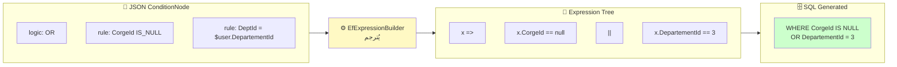

**خطوات البناء:**

1. **Leaf Node** (شرط بسيط): بناء `MemberExpression` للحقل + `ConstantExpression` للقيمة + عامل المقارنة
2. **Composite Node** (شرط مركّب): بناء كل الأبناء ثم دمجهم بـ `AndAlso` أو `OrElse`
3. **Allow Rules**: يبني التعبير مباشرة
4. **Deny Rules**: يعكس التعبير بـ `Expression.Not(...)` ← `WHERE NOT (Dtdetachement IS NOT NULL)`
5. **المتغيرات `$`**: تُستبدل عبر `PermissionContext.ResolveValue()` قبل البناء
6. **تحويلات النوع**: يتعامل مع `Nullable<T>`, `Guid`, `Enum`, والقوائم المفصولة بفواصل

### 4.9 آلية الدمج (Merge) — عدة أدوار

عندما يكون للمستخدم أكثر من دور:

| المستوى | طريقة الدمج | المثال |
|---------|-------------|--------|
| **Modules** | **OR** | دور1 يفعّل `AX_RECRUTEMENT` + دور2 يفعّل `AX_PERSONNEL` → النتيجة: كلاهما مفعّل |
| **Schema** | **Union** | دور1: `["read", "create"]` + دور2: `["read", "update"]` → النتيجة: `["read", "create", "update"]` |
| **DataRow** | **تجميع** | كل القواعد تُجمع وتُرتّب حسب الأولوية |

**ملخص الدمج:** `PermissionPolicyProvider.MergeModulesPermissions()` و `MergeSchemaPermissions()` و `MergeDataRowPolicies()`.

---

## 5. 🔗 المتغيرات الديناميكية و Context Variables

### 5.1 المتغيرات المدعومة

| المتغير | المصدر | الوصف |
|---------|--------|-------|
| `$user.Id` | `User.Id` | معرّف المستخدم |
| `$user.PersonnelId` | `User.PersonnelId` | معرّف ملفه الشخصي |
| `$user.CorgeId` | `User.CorgeId` | معرّف فيلق المستخدم |
| `$user.DepartementId` | `User.DepartementId` | معرّف قسم المستخدم |
| `$user.Username` | `User.Username` | اسم المستخدم |
| `$user.Email` | `User.Email` | البريد الإلكتروني |
| `$user.Matricule` | `User.Matricule` | رقم التسجيل |
| `$context.xxx` | `PermissionContext.Values` | قيمة مخصصة |
| `$xxx` | `PermissionContext.Values` | اختصار |

### 5.2 نظام أولوية القيم

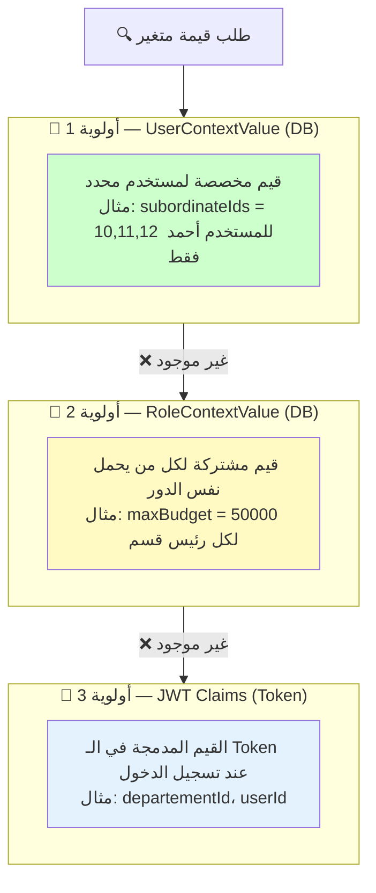

> **ملاحظة:** إذا وُجدت قيمة `subordinateIds` في `UserContextValue` فتُستخدم، و إلا يُبحث في `RoleContextValue`، و إلا يُبحث في JWT Claims.

### 5.3 استخدام المتغيرات في DataRow Rules

```json
{
  "left": "DepartementId",
  "operator": "=",
  "right": "$user.DepartementId"
}
```

في وقت التشغيل: إذا المستخدم في القسم 3 → يُترجم إلى `WHERE DepartementId = 3`.

```json
{
  "left": "PersonnelId",
  "operator": "IN",
  "right": "$context.subordinateIds"
}
```

في وقت التشغيل: إذا `subordinateIds = "10,11,12"` → يُترجم إلى `WHERE PersonnelId IN (10, 11, 12)`.

---

## 6. ⚖️ الحلول المقترحة — الإيجابيات و السلبيات

### 6.1 الحل المختار: JSON-Based Permission Engine

#### ✅ الإيجابيات

| الإيجابية | التفسير |
|-----------|---------|
| **مرونة عالية** | تعديل أو إضافة صلاحيات = تعديل نص JSON فقط، بدون Migration أو إعادة نشر |
| **لا حاجة لتغيير Schema** | جدول واحد يحتوي 3 أعمدة JSON → أي قاعدة جديدة لا تتطلب `ALTER TABLE` |
| **تعبير عن شروط معقدة** | AND/OR متداخلة، 13 عامل مقارنة، متغيرات ديناميكية |
| **قابلية النسخ** | `ClonePermission` → نسخ صلاحيات دور كامل لدور جديد بنقرة |
| **Separation of Concerns** | كل مستوى يعمل في طبقته → لا تداخل بين Controller و Handler و Repository |
| **Expression Trees** | التصفية تحدث على مستوى SQL → لا يتم تحميل بيانات غير مسموحة في الذاكرة |
| **Admin Bypass** | `IsAdmin = true` يتجاوز كل الفحوصات → أداء أفضل لمدير النظام |
| **Multi-Role Merge** | دمج ذكي لصلاحيات الأدوار المتعددة (OR للوحدات, Union للعمليات) |

#### ❌ السلبيات

| السلبية | التأثير | الحل المقترح |
|---------|--------|-------------|
| **لا تحقق من صحة JSON في DB** | يمكن حفظ JSON فاسد | ✅ محلول: `PermissionValidationService` يتحقق قبل الحفظ |
| **صعوبة Debug** | تتبع لماذا مُنع المستخدم يتطلب فهم JSON + Expression | ✅ محلول جزئياً: Audit Log يسجل كل عملية |
| **لا indexing على JSON** | البحث داخل JSON بطيء (لكننا لا نبحث، فقط نحمّل) | ✅ محلول: Caching 5 دقائق يحل المشكلة |
| **تعقيد Expression Builder** | `EfExpressionBuilder` معقد (تحويلات Nullable, Guid, Enum) | ⚠️ يتطلب مطور متمرس للصيانة |
| **JSON حجمه قد يكبر** | إذا كان هناك 100 جدول × 20 حقل = JSON كبير | ⚠️ مقبول حتى عدّة KB — لا تأثير مع Caching |
| **لا support DB-level RLS** | التصفية في Application layer وليس DB | ✅ مقصود: مرونة أكبر مع dynamic variables |

### 6.2 بدائل دُرست ولم تُتبنى

#### البديل 1: RBAC تقليدي (Role-Based Access Control) بجداول مخصصة

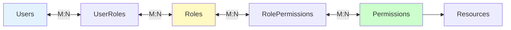

| المعيار | RBAC تقليدي | حلنا (JSON Engine) |
|---------|-------------|-------------------|
| المرونة | ❌ محدود بـ CRUD على Resources | ✅ شروط ديناميكية غير محدودة |
| Row-Level Security | ❌ غير مدعوم | ✅ أساسي في التصميم |
| Schema Changes | ❌ كل إضافة = Migration جديد | ✅ تعديل JSON فقط |
| الأداء | ✅ JOIN على جداول مفهرسة | ⚠️ تحميل JSON + parsing (محلول بـ Cache) |
| البساطة | ✅ أسهل للفهم | ⚠️ يتطلب فهم الهيكل |

**لماذا لم نختره:** لا يدعم Row-Level Security بمتغيرات ديناميكية (أهم متطلب).

#### البديل 2: Policy-Based (مثل ASP.NET Authorization Policies)

```csharp
[Authorize(Policy = "CanEditRecruitment")]
public ActionResult Edit() { ... }
```

| المعيار | Policy-Based | حلنا |
|---------|-------------|------|
| المرونة | ⚠️ Policy لكل حالة → عشرات الـ Policies | ✅ 3 ملفات JSON فقط |
| الإدارة | ❌ تتطلب إعادة نشر عند إضافة Policy | ✅ تعديل في DB مباشرة |
| Row-Level | ❌ غير مدعوم natively | ✅ مدمج |
| التعبيرية | ⚠️ يحتاج code لكل شرط | ✅ JSON يعبّر عن أي شرط |

**لماذا لم نختره:** عدد الـ Policies يتضخم بسرعة مع كل جدول/حقل/عملية جديدة.

#### البديل 3: Row-Level Security في قاعدة البيانات (SQL Server RLS)

```sql
CREATE SECURITY POLICY PersonnelFilter
    ADD FILTER PREDICATE dbo.fn_SecurityPredicate(DepartementId)
    ON dbo.Personnel;
```

| المعيار | SQL RLS | حلنا |
|---------|---------|------|
| الأداء | ✅ أسرع (على مستوى DB) | ⚠️ Application-level (لكن مع Cache) |
| المرونة | ❌ ثابت — تغيير يحتاج ALTER | ✅ JSON ديناميكي |
| المتغيرات | ❌ محدود لـ SESSION_CONTEXT | ✅ `$user.*` + `$context.*` غير محدود |
| Multi-Tenant | ✅ جيد | ✅ جيد |
| الإدارة | ❌ يحتاج DBA | ✅ Admin Panel في الواجهة |

**لماذا لم نختره:** لا يمكن إدارته من واجهة المستخدم، والمتغيرات محدودة.

### 6.3 ملخص المقارنة

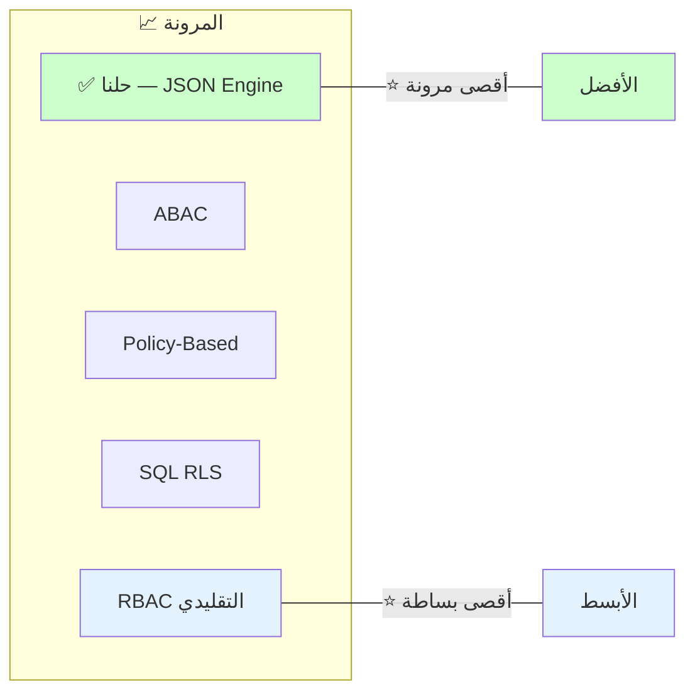

> **اخترنا أقصى مرونة** مع **تعقيد محكوم** بفضل: Caching + Validation + Admin UI.

---

## 7. 🚀 إدماج Permission Engine في المحاور الجديدة

### 7.1 المبدأ الأساسي

محرك الصلاحيات مصمم ليكون **مستقل تماماً عن وحدة التوظيف** أو أي وحدة أخرى. لإضافة محور جديد (مثلاً: **إدارة الإجازات**، **إدارة المعدات**، **إدارة المالية**)، يكفي:

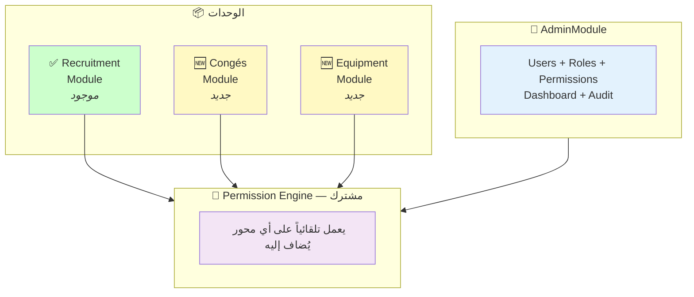

### 7.2 خطوات إضافة محور جديد — مثال: وحدة الإجازات (Congés)

#### الخطوة 1: تعريف الوحدات (Modules) في ModulesPermissionJson

<details>
<summary>📄 مثال — إضافة محور الإجازات في ModulesPermissionJson</summary>

```json
{
  "axes": {
    "AX_CONGES": {
      "enabled": true,
      "modules": {
        "CONGES_LIST":    { "enabled": true },
        "CONGES_ADD":     { "enabled": true },
        "CONGES_APPROVE": { "enabled": true },
        "CONGES_REPORT":  { "enabled": true }
      }
    }
  }
}
```

</details>

> **ملاحظة:** لا يحتاج أي تعديل في كود المحرك — فقط JSON جديد.

#### الخطوة 2: تعريف الصلاحيات على الجداول (SchemaPermissionJson)

<details>
<summary>📄 مثال — SchemaPermissionJson لوحدة الإجازات</summary>

```json
{
  "tables": {
    "Conge": {
      "actions": ["read", "create"],
      "fields": {
        "DateDebut":    { "actions": ["read", "update"] },
        "DateFin":      { "actions": ["read", "update"] },
        "Type":         { "actions": ["read"] },
        "Status":       { "actions": ["read"] },
        "PersonnelId":  { "actions": ["read"] }
      }
    },
    "TypeConge": {
      "actions": ["read"],
      "fields": { "*": { "actions": ["read"] } }
    }
  }
}
```

</details>

#### الخطوة 3: تعريف قواعد تصفية الصفوف (DataRowPermissionJson)

<details>
<summary>📄 مثال — DataRowPermissionJson لوحدة الإجازات</summary>

```json
{
  "rules": [
    {
      "table": "Conge",
      "effect": "allow",
      "priority": 100,
      "description": "يرى فقط إجازات موظفي قسمه",
      "conditions": {
        "logic": "AND",
        "rules": [
          {
            "left": "PersonnelId",
            "operator": "IN",
            "right": "$context.subordinateIds"
          }
        ]
      }
    }
  ]
}
```

</details>

#### الخطوة 4: إنشاء Controller جديد

<details>
<summary>📄 مثال — CongesController.cs</summary>

```csharp
[ApiController]
[Route("api/[controller]")]
[Authorize]
public class CongesController : ControllerBase
{
    private readonly IPermissionService _permissionService;
    private readonly CongesQueryHandler _queryHandler;

    [HttpGet]
    public async Task<ActionResult> GetConges()
    {
        // المستوى 1: هل يملك حق الوصول؟
        if (!_permissionService.CanAccessModule("AX_CONGES", "CONGES_LIST"))
            return Forbid();

        return Ok(await _queryHandler.GetAllAsync());
    }

    [HttpPost]
    public async Task<ActionResult> CreateConge(CreateCongeCommand command)
    {
        // المستوى 1
        if (!_permissionService.CanAccessModule("AX_CONGES", "CONGES_ADD"))
            return Forbid();

        return Ok(await _commandHandler.HandleAsync(command));
    }
}
```

</details>

#### الخطوة 5: استخدام Schema + DataRow في Handler/Repository

<details>
<summary>📄 مثال — استخدام المحرك في Handler و Repository</summary>

```csharp
// في Handler — المستوى 2
public async Task<ResultDto> HandleAsync(CreateCongeCommand command)
{
    if (!_permissionService.CanTableAction("Conge", "create"))
        return ResultDto.FailureResult("ليس لديك صلاحية إنشاء إجازة");

    // ... إنشاء السجل
}

// في Repository — المستوى 3
public async Task<List<Conge>> GetCongesAsync()
{
    var query = _permissionService.ApplyRowFilter(
        _dbContext.Conges.Include(c => c.Personnel),
        "Conge"
    );
    // ← يُضاف WHERE تلقائياً حسب صلاحياته
    return await query.ToListAsync();
}
```

</details>

### 7.3 ما الذي لا يحتاج تعديل عند إضافة محور جديد؟

| المكوّن | يحتاج تعديل؟ | السبب |
|---------|-------------|-------|
| `PermissionService.cs` | ❌ لا | يعمل بأسماء جداول/محاور عامة |
| `EfExpressionBuilder.cs` | ❌ لا | يبني Expression من أي ConditionNode |
| `PermissionContextMiddleware.cs` | ❌ لا | يحمّل JSON كاملاً مهما كان المحتوى |
| `PermissionPolicyProvider.cs` | ❌ لا | يقرأ ويدمج JSON بشكل عام |
| `CachedPermissionPolicyProvider.cs` | ❌ لا | يخزن مؤقتاً أي نتيجة |
| **ModulesPermissionJson** | ✅ نعم | إضافة المحور الجديد |
| **SchemaPermissionJson** | ✅ نعم | إضافة الجداول والحقول الجديدة |
| **DataRowPermissionJson** | ✅ نعم | إضافة قواعد التصفية الجديدة |
| **Controller جديد** | ✅ نعم | كود المحور الجديد |
| **Handler جديد** | ✅ نعم | كود المحور الجديد |
| **Repository جديد** | ✅ نعم | كود المحور الجديد |

**الملخص:** محرك الصلاحيات **لا يحتاج أي تعديل** — فقط الكود الجديد للمحور + تكوين JSON.

### 7.4 استخدام المحرك كتطبيق مستقل (Microservice)

إذا أردنا فصل كل محور كتطبيق مستقل (Microservice):

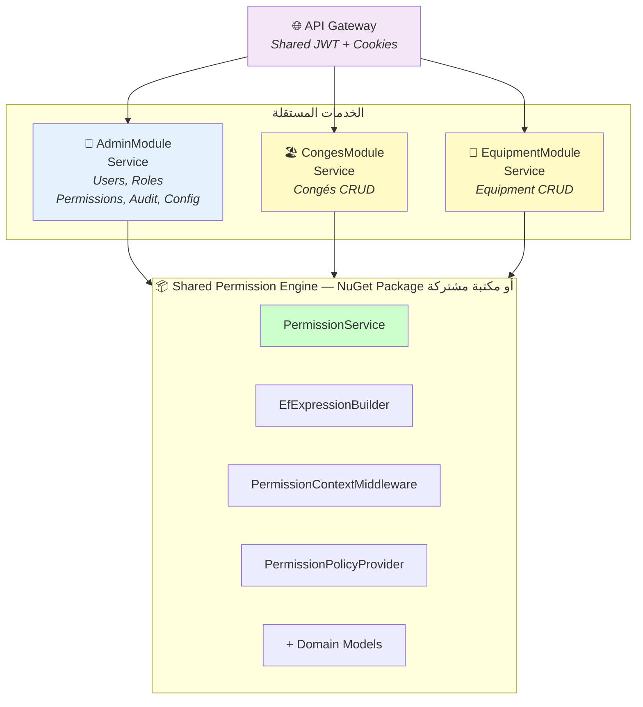

**الخطوات:**

<details>
<summary>📄 خطوات تحويل المحرك لـ NuGet Package</summary>

1. **استخراج NuGet Package**: نأخذ `Domain/Permessions/` + `Application/Permissions/` + `Infrastructure/Permissions/` + `Middleware/` → مكتبة NuGet مشتركة
2. **مشاركة قاعدة البيانات**: جدول `Permissions` في DB مشتركة أو API مشتركة
3. **كل Microservice**:
   ```csharp
   // في Program.cs لكل خدمة
   builder.Services.AddPermissionEngine(configuration);
   // ...
   app.UsePermissionContext(); // Middleware
   ```
4. **المصادقة المشتركة**: نفس JWT Secret → كل الخدمات تقرأ نفس الـ Token

</details>

**تحديات Microservice:**
- مزامنة الصلاحيات بين الخدمات (يُحل بـ Event Bus أو Shared DB)
- إبطال Cache عبر الخدمات (يُحل بـ Redis pub/sub)

---

## 8. 🔒 الأمان (Security Architecture)

### 8.1 المصادقة (Authentication)

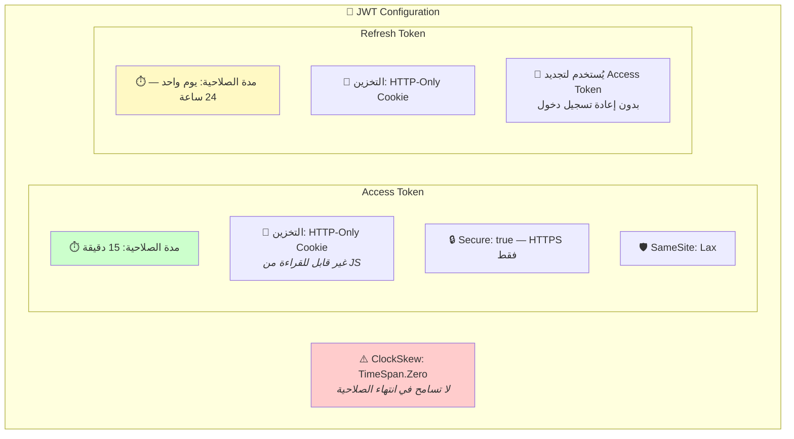

### 8.2 الـ API Proxy (Frontend → Backend)

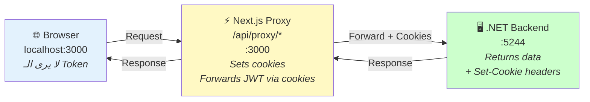

**لماذا Proxy؟**
- الـ Access Token **لا يظهر أبداً** في JavaScript
- حماية من **XSS**: حتى لو حُقن script، لا يمكنه سرقة الـ Token
- الـ Cookies تُرسل تلقائياً مع كل طلب
- **إصلاح حرج:** تم حل مشكلة `Set-Cookie` (append بدل set) لضمان تمرير cookies من Backend

### 8.3 الأمان متعدد الطبقات

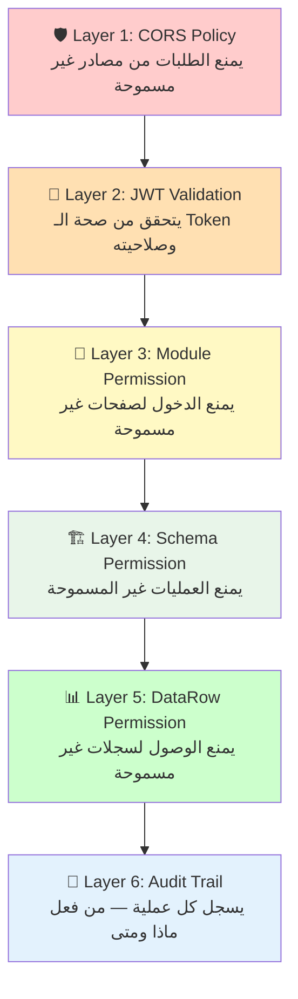

---

## 9. 💻 بنية الواجهة الأمامية (Frontend Architecture)

### 9.1 بنية المجلدات

```
src/
├── app/                          # Next.js App Router
│   ├── (auth)/login/             # صفحة تسجيل الدخول
│   ├── (dashboard)/              # Layout محمي
│   │   ├── dashboard/            # لوحة التحكم
│   │   ├── users/                # إدارة المستخدمين
│   │   │   └── [id]/             # تفاصيل المستخدم
│   │   ├── roles/                # إدارة الأدوار
│   │   │   └── [id]/             # تفاصيل الدور + الصلاحيات
│   │   ├── permissions/          # إدارة الصلاحيات الكاملة
│   │   └── recruitment/          # وحدة التجنيد
│   └── api/proxy/[...path]/      # API Proxy → Backend
│
├── components/
│   ├── ui/                       # shadcn/ui (57+ مكوّن)
│   ├── dashboard/                # مكوّنات لوحة التحكم
│   ├── layout/                   # Sidebar, Header, AppShell
│   └── permissions/              # محرر الصلاحيات (Visual)
│
├── lib/
│   ├── api/                      # API client functions
│   ├── hooks/                    # Custom React hooks
│   └── stores/                   # Zustand stores
│
└── styles/
    └── globals.css               # Tailwind + animations + themes
```

### 9.2 إدارة الحالة (State Management)

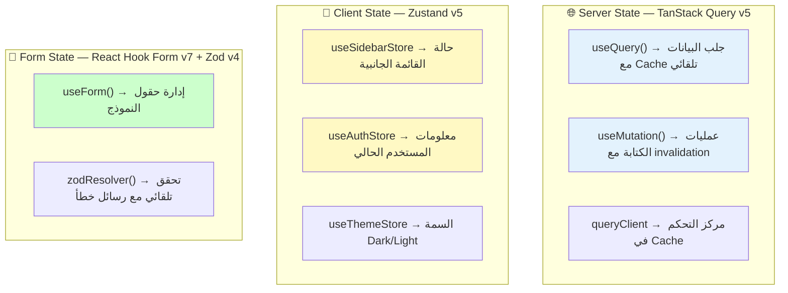

### 9.3 محرر الصلاحيات البصري (Permission Editor)

الـ Frontend يوفر واجهة بصرية لتعديل الصلاحيات الثلاثة:

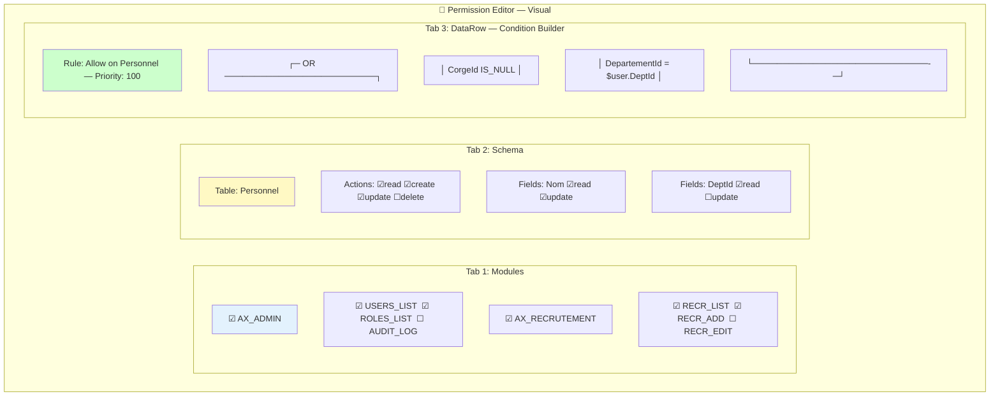

> **ملاحظة:** يشمل **Autocomplete** للمتغيرات الديناميكية (`$user.*`, `$context.*`) في حقل `right`.

---

## 10. ⚡ الأداء والتخزين المؤقت (Performance & Caching)

### 10.1 استراتيجية الـ Caching

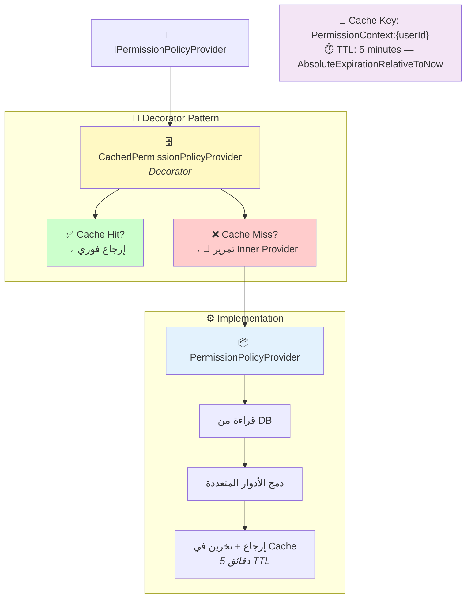

**سجّل الـ DependencyInjection:**

<details>
<summary>📄 تسجيل Decorator Pattern في DI</summary>

```csharp
// Decorator Pattern — بدون مكتبة خارجية
services.AddScoped<PermissionPolicyProvider>();         // Inner
services.AddScoped<IPermissionPolicyProvider>(sp =>     // Decorator
{
    var inner = sp.GetRequiredService<PermissionPolicyProvider>();
    var cache = sp.GetRequiredService<IMemoryCache>();
    return new CachedPermissionPolicyProvider(inner, cache);
});
```

</details>

### 10.2 إبطال الـ Cache

<details>
<summary>📄 كود إبطال الـ Cache</summary>

```csharp
// عند تعديل صلاحيات دور:
public class PermissionCacheInvalidator : IPermissionCacheInvalidator
{
    public void InvalidateForUser(int userId)
        => _cache.Remove($"PermissionContext:{userId}");

    public void InvalidateForRole(int roleId)
    {
        // إيجاد كل المستخدمين بهذا الدور → إبطال cache لكل واحد
    }

    public void InvalidateAll()
        // إبطال كل الـ cache
}
```

</details>

### 10.3 أرقام الأداء

| العملية | بدون Cache | مع Cache |
|---------|-----------|---------|
| تحميل PermissionContext | ~50ms (DB query + merge) | < 1ms (memory read) |
| تحميل Context Variables | ~20ms (DB query) | < 1ms (مدمج في context) |
| ApplyRowFilter | ~5ms (expression build) | ~5ms (لا يُخزّن لأنه يعتمد على الـ query) |
| CanAccessModule | < 0.1ms (dictionary lookup) | < 0.1ms |

---

## 11. 🗺️ خريطة الطريق (Roadmap)

### ما تم إنجازه ✅

- [x] محرك الصلاحيات ثلاثي المستويات (Modules, Schema, DataRow)
- [x] المتغيرات الديناميكية مع نظام الأولوية (User → Role → JWT)
- [x] EfExpressionBuilder مع 13 عامل مقارنة
- [x] Caching بنمط Decorator مع TTL 5 دقائق
- [x] إدارة المستخدمين (CRUD, تعيين الأدوار, تعطيل/تفعيل)
- [x] إدارة الأدوار (CRUD, نسخ, تعطيل/تفعيل)
- [x] محرر الصلاحيات البصري (3 tabs)
- [x] لوحة التحكم مع رسوم بيانية
- [x] سجل المراجعة (Audit Trail)
- [x] إعدادات النظام
- [x] وحدة التجنيد (كتطبيق عملي)
- [x] JWT مع HTTP-Only Cookies
- [x] API Proxy آمن
- [x] تصميم UI احترافي (12 إصلاح + 10 تحسينات تصميمية)

### ما يمكن إضافته مستقبلاً 🔮

- [ ] استخراج Permission Engine كـ NuGet Package
- [ ] إضافة محاور جديدة (إجازات, معدات, مالية)
- [ ] Redis Cache بدل Memory Cache (لدعم Microservices)
- [ ] Event Bus لمزامنة الصلاحيات (RabbitMQ / MassTransit)
- [ ] Permission Simulation (محاكاة صلاحيات دور قبل تفعيله)
- [ ] Permission Diff (مقارنة صلاحيات دورين)
- [ ] تقارير الصلاحيات (من يملك حق الوصول لماذا)

---

## 📎 ملحق: الدوال المتاحة في PermissionService

| الدالة | المستوى | الوصف |
|--------|---------|-------|
| `CanAccessAxis(axisCode)` | 1 | هل المحور مفعّل؟ |
| `CanAccessModule(axisCode, moduleCode)` | 1 | هل الوحدة/الصفحة مفعّلة؟ |
| `CanTableAction(table, action)` | 2 | هل العملية مسموحة على الجدول؟ |
| `CanFieldAction(table, field, action)` | 2 | هل العملية مسموحة على الحقل؟ |
| `GetReadableFields(table)` | 2 | قائمة الحقول القابلة للقراءة |
| `GetUpdatableFields(table)` | 2 | قائمة الحقول القابلة للتعديل |
| `ApplyRowFilter<T>(IQueryable<T>, table)` | 3 | إضافة WHERE تلقائي على الاستعلام |
| `CanAccessRow<T>(entity, table)` | 3 | هل السجل مسموح الوصول إليه؟ |

---

> **إعداد:** تم إنشاء هذا العرض التقني تلقائياً بناءً على التحليل الكامل لمصادر المشروع.
>
> **التقنيات الرئيسية:** .NET 8 • EF Core 8 • SQL Server • Next.js 15 • React 19 • TypeScript • Tailwind CSS v4 • shadcn/ui • TanStack • Zustand • JWT
